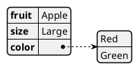
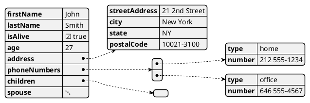
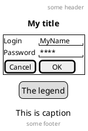
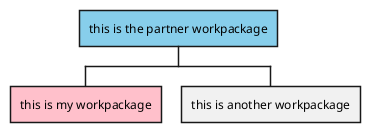
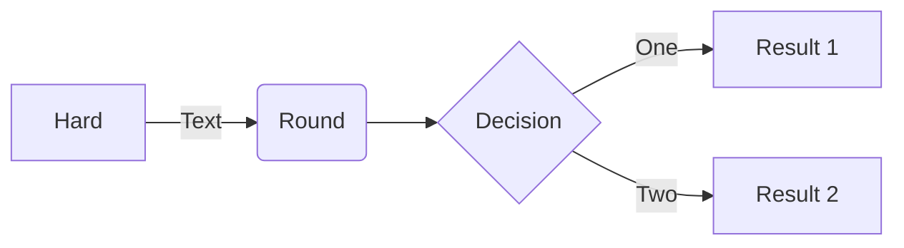
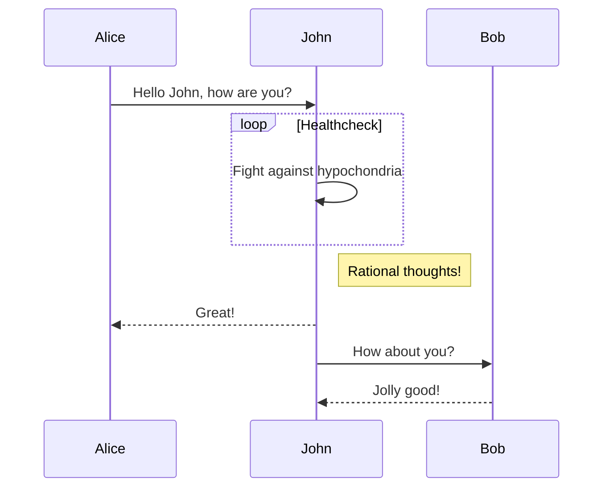
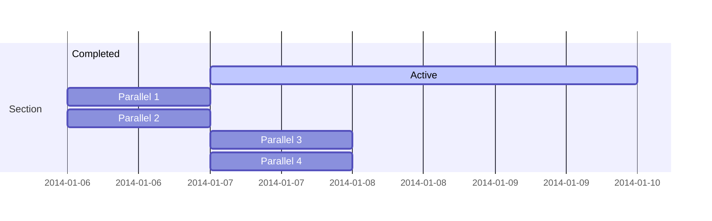
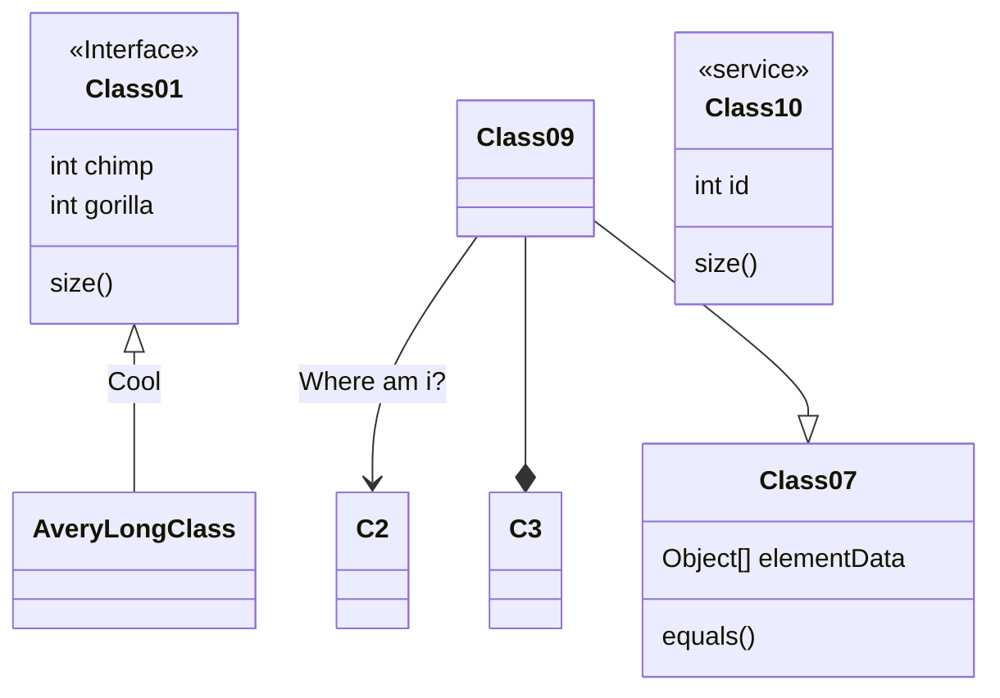
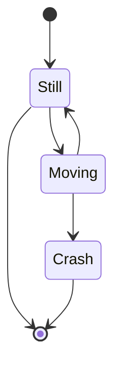
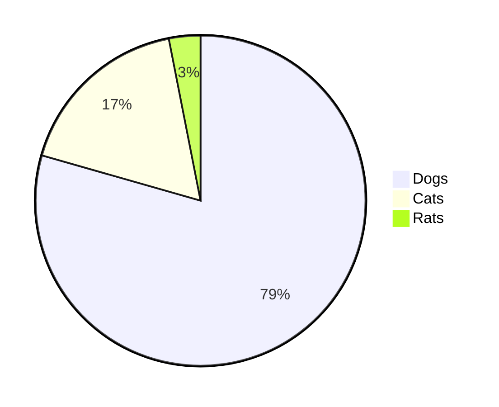

# Diagrams

- powered by [Markdown Preview Enhanced](https://shd101wyy.github.io/markdown-preview-enhanced/#/diagrams)

## Sequence Diagrams

- code block with sequence notation will be rendered by [js-sequence-diagrams](https://bramp.github.io/js-sequence-diagrams/>).
- Two themes are supported: `simple` (default theme) and `hand`.

```sequence {theme='hand'}
Andrew->China: Says Hello
Note right of China: China thinks\nabout it
China-->Andrew: How are you?
Andrew->>China: I am good thanks!
```

## PlantUML

- You can install Graphviz (not required) to generate all diagram types.
- Code block with `puml` or `plantuml` notation will be rendered by [PlantUML](https://plantuml.com/).
- [Themes](https://plantuml.com/theme)
- [Puml THemes](https://bschwarz.github.io/puml-themes/gallery.html)

#### [YAML](https://plantuml.com/yaml)



#### [JSON](https://plantuml.com/json)



#### [Gantt diagram](https://plantuml.com/gantt-diagram)

```plantuml
[Prototype design] lasts 15 days
[Test prototype] lasts 10 days
-- All example --
[Task 1 (1 day)] lasts 1 day
[T2 (5 days)] lasts 5 days
[T3 (1 week)] lasts 1 week
[T4 (1 week and 4 days)] lasts 1 week and 4 days
[T5 (2 weeks)] lasts 2 weeks
```

#### [Salt (Wireframe)](https://plantuml.com/salt)



#### [WBS diagram](https://plantuml.com/wbs-diagram)



#### [Sequence diagram](https://plantuml.com/sequence-diagram)

```plantuml
!theme plain
Alice -> Bob: Authentication Request
Bob --> Alice: Authentication Response

Alice -> Bob: Another authentication Request
Alice <-- Bob: Another authentication Response
```

#### [Usecase diagram](https://plantuml.com/use-case-diagram)

```plantuml
!theme spacelab
User -> (Start)
User --> (Use the application) : A small label

:Main Admin: ---> (Use the application) : This is\nyet another\nlabel
```

#### [Class diagram](<https://plantuml.com/class-diagram>)

```plantuml
!theme _none_
abstract class AbstractList
abstract AbstractCollection
interface List
interface Collection

List <|-- AbstractList
Collection <|-- AbstractCollection

Collection <|- List
AbstractCollection <|- AbstractList
AbstractList <|-- ArrayList

class ArrayList {
  Object[] elementData
  size()
}

enum TimeUnit {
  DAYS
  HOURS
  MINUTES
}

annotation SuppressWarnings

annotation Annotation {
  annotation with members
  String foo()
  String bar()
}
```

#### [Object diagram](https://plantuml.com/object-diagram)

```plantuml
!theme minty
object London
object Washington
object Berlin
object NewYork

map CapitalCity {
 UK *-> London
 USA *--> Washington
 Germany *---> Berlin
}

NewYork --> CapitalCity::USA
```

#### [Activity diagram](https://plantuml.com/activity-diagram-beta)

```plantuml
!theme lightgray
start

repeat :foo as starting label;
  :read data;
  :generate diagrams;
backward:This is backward;
repeat while (more data?)

stop
```

#### [Component Diagram](<https://plantuml.com/component-diagram>)

```plantuml
!theme lightgray
package "Some Group" {
  HTTP - [First Component]
  [Another Component]
}

node "Other Groups" {
  FTP - [Second Component]
  [First Component] --> FTP
}

cloud {
  [Example 1]
}


database "MySql" {
  folder "This is my folder" {
    [Folder 3]
  }
  frame "Foo" {
    [Frame 4]
  }
}


[Another Component] --> [Example 1]
[Example 1] --> [Folder 3]
[Folder 3] --> [Frame 4]
```

#### [Deployment Diagram]([<https://plantuml.com/component-diagram>](https://plantuml.com/deployment-diagram))

```plantuml
actor foo1
actor foo2
foo1 <-0-> foo2
foo1 <-(0)-> foo2

(ac1) -le(0)-> left1
ac1 -ri(0)-> right1
ac1 .up(0).> up1
ac1 ~up(0)~> up2
ac1 -do(0)-> down1
ac1 -do(0)-> down2

actor1 -0)- actor2

component comp1
component comp2
comp1 *-0)-+ comp2
[comp3] <-->> [comp4]

boundary b1
control c1
b1 -(0)- c1

component comp1
interface interf1
comp1 #~~( interf1

:mode1actor: -0)- fooa1
:mode1actorl: -ri0)- foo1l

[component1] 0)-(0-(0 [componentC]
() component3 )-0-(0 "foo" [componentC]

[aze1] #-->> [aze2]
```

#### [State Diagram](https://plantuml.com/state-diagram)

```plantuml
[*] --> State1
State1 --> [*]
State1 : this is a string
State1 : this is another string

State1 -> State2
State2 --> [*]
```

#### [Timing Diagram](https://plantuml.com/timing-diagram)

```plantuml
robust "Web Browser" as WB
concise "Web User" as WU

@0
WU is Idle
WB is Idle

@100
WU -> WB : URL
WU is Waiting #LightCyan;line:Aqua

@200
WB is Proc.

@300
WU -> WB@350 : URL2
WB is Waiting

@+200
WU is ok

@+200
WB is Idle

highlight 200 to 450 #Gold;line:DimGrey : This is my caption
```

## Vega and Vega-lite

- Markdown Preview Enhanced supports [vega](https://vega.github.io/vega/) and [vega-lite](https://vega.github.io/vega-lite/) **static** diagrams.

- Code block with `vega` notation will be rendered by vega.
- Code block with `vega-lite` notation will be rendered by vega-lite.
- Both `JSON` and `YAML` inputs are supported.

```vega-lite
{
  "$schema": "https://vega.github.io/schema/vega-lite/v5.json",
  "description": "A simple bar chart with embedded data.",
  "width":500,
  "height":200,
  "data": {
    "values": [
      {"a": "A", "b": 28}, {"a": "B", "b": 55}, {"a": "C", "b": 43},
      {"a": "D", "b": 91}, {"a": "E", "b": 81}, {"a": "F", "b": 53},
      {"a": "G", "b": 19}, {"a": "H", "b": 87}, {"a": "I", "b": 52}
    ]
  },
  "mark": "bar",
  "encoding": {
    "x": {"field": "a", "type": "nominal", "axis": {"labelAngle": 0}},
    "y": {"field": "b", "type": "quantitative"}
  }
}
```


## Mermaid

- code block with mermaid notation will be rendered by [mermaid](https://github.com/knsv/mermaid).
- check mermaid doc for more information about how to create flowchart and sequence diagram













## Flow Charts

- Powered by [flowchart.js](<https://flowchart.js.org/>)

```flow {theme='hand'}
st=>start: Start:>http://www.google.com[blank]
e=>end:>http://www.google.com
op1=>operation: My Operation
sub1=>subroutine: My Subroutine
cond=>condition: Yes
or No?:>http://www.google.com
io=>inputoutput: catch something...
para=>parallel: parallel tasks

st->op1->cond
cond(yes)->io->e
cond(no)->para
para(path1, bottom)->sub1(right)->op1
para(path2, top)->op1
```
