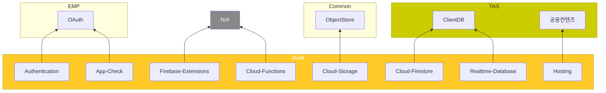
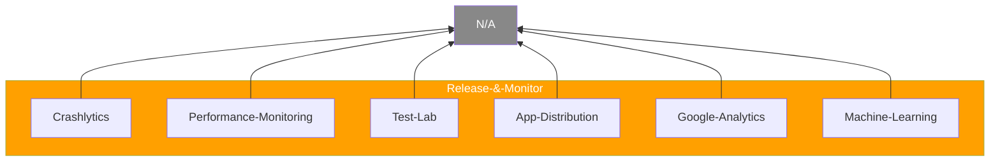
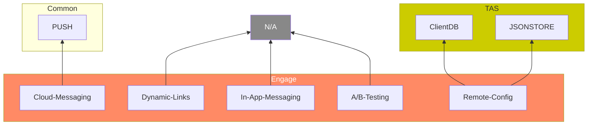

# TAS/연구소 관점에서의 Googe Firebase

- [Description](#description)
- [Summary](#summary)
- [제품 in Firebase umbrella](#제품-in-firebase-umbrella)
- [Firebase 하위 제품 및 연구소 내 해당 서비스](#firebase-하위-제품-및-연구소-내-해당-서비스)
  - [Build 제품군](#build-제품군)
  - [Release & Monitor 제품군](#release--monitor-제품군)
  - [Engage 제품군](#engage-제품군)
- [제품군 별 상세 feature 및 적용 검토](#제품군-별-상세-feature-및-적용-검토)
  - [Build 제품군](#build-제품군-1)
  - [Release & Monitor 제품군](#release--monitor-제품군-1)
  - [Engage 제품군](#engage-제품군-1)

## Description

- TAS / 연구소 관점에서 Google Firebase를 검토하여 취할만한 [Firebase](<https://firebase.google.com/?hl=ko&gclid=Cj0KCQjwpv2TBhDoARIsALBnVnlphkBo1mikObG5Be-K8Qpm1Ne0cUrzoK4MygEdVFqRH3jcfeFIKDMaAoFxEALw_wcB&gclsrc=aw.ds>)의 서비스를 알아본다.

## Summary

- Firebase는 앱 중심의 Google 서비스로서 다양한 하위 제품이 있음
- 전반의 검토 결과, Build 제품군 서비스는 연구소에서 상당부분 커버 중이나, Engage 제품군, 특히 데이터 기반으로한 서비스 부분은 취약
- Analytics나 ML 데이터을 통한 사용자 세그멘테이션 데이터에 기반한 서비스가 상당하며(Engage 제품 군)) 이에 대한 준비 대응이 필요해보임.
- **현 TAS 서비스 관점의 추가 대상 feature 검토 요약**
  - **ClientDB** : 개인화 뿐 아니라 일반 데이터로의 확장 / 기기 기반 특화 서비스 지원(기기 데이터 동기화 등)
  - **공용컨텐츠** : CDN 적용 / (자유로운) 정적컨텐츠 web hosting
  - **앱/기기 인증** : TAS는 사용자 신원 증명인 EMP OAuth를 기기/앱 인증으로도 사용 중인데(public/private API 구분), 앱/기기 인증 수단을 별도로 구성해야하는지 확인

## 제품 in Firebase umbrella

Firebase는 서비스 lifecycle에 따라 하기 3개 제품군으로 나뉨

- **[Build](https://firebase.google.com/products-build?hl=ko)** : 서비스 lifecycle 중 개발 단계에 필요한 feature 모음
- **[Release & Monitor](https://firebase.google.com/products-engage)** : 서비스 lifecycle 중 개발 단계에 필요한 feature 모음
- **[Engage](https://firebase.google.com/products-engage)** : 서비스 lifecycle 중 개발 단계에 필요한 feature 모음

## Firebase 하위 제품 및 연구소 내 해당 서비스

### Build 제품군

| Firebase 제품 | 설명 | 연구소 내 서비스 |
|---|---|---|---|
| **[Cloud Firestore](https://firebase.google.com/docs/firestore/)** | Document store 타입의 NoSQL 데이터베이스 (신규) | ClientDB in TAS |
| **[Realtime Database](https://firebase.google.com/docs/database/)** | Document store 타입의 NoSQL 데이터베이스 (기존) | ClientDB in TAS |
| **[Cloud Functions](https://firebase.google.com/docs/functions)** | Firebase 기능 및 HTTPS을 통한 이벤트로 트리거되는 서버리스 프레임워크 | N/A |
| **[Firebase Extensions](https://firebase.google.com/docs/extensions?hl=ko)** | Firebase 타 제품으로부터의 각종 Event가 발생할 때마다 수행되는 코드(*Cloud Functions* 기반) | N/A |
| **[Hosting](https://firebase.google.com/docs/hosting)** | 웹앱, 정적 컨텐츠, 동적 컨텐츠(Cloud Function과 연계) 호스팅 서비스 | 공용컨텐츠 in TAS |
| **[Cloud Storage](https://firebase.google.com/docs/storage)** | 사진, 동영상 등의 사용자 제작 컨텐츠를 대상으로 하는 객체 저장소 서비스  | ObjectStore in Common |
| **[Authentication](https://firebase.google.com/docs/auth)** | 사용자 인증 서비스 | OAuth in EMP |
| **[App Check](https://firebase.google.com/docs/app-check?hl=ko)** | 기기 및 앱 인증 서비스 | OAuth in EMP |

### Release & Monitor 제품군

| Firebase 제품 | 설명 | 연구소 내 서비스 |
|---|---|---|---|
| **[Crashlytics](https://firebase.google.com/docs/crashlytics?hl=ko)** | App의 버그/비정상종료 분석 서비스 | N/A |
| **[Performance Monitoring](https://firebase.google.com/docs/perf-mon?hl=ko)** | App의 성능 모니터링 서비스 | N/A |
| **[Test Lab](https://firebase.google.com/docs/test-lab?hl=ko)** | Google 서버에서의 앱 테스트 | N/A |
| **[App Distribution](https://firebase.google.com/docs/app-distribution?hl=ko)** | 쉬운 배포, 테스트 전용 배포, Crashlytics와 통합 지원 앱 배포 서비스 | N/A |
| **[Google Analytics](https://firebase.google.com/docs/analytics?hl=ko)** | 타 Firebase와의 통합 기반 App 내 고유 이벤트에 대한 측정 및 리포팅 서비스 | N/A |
| **[Machine Learning](https://firebase.google.com/docs/ml?hl=ko)** | 머신러닝 기반 feature를 제공 가능케 하는 서비스 | N/A |

### Engage 제품군

| Firebase 제품 | 설명 | 연구소 내 서비스 |
|---|---|---|---|
| **[Remote Config](https://firebase.google.com/docs/remote-config?hl=ko)** | 앱 업데이트 없이 앱의 기본값 변경. 특정 사용자 층에만 변경 지원, A/B 테스트 지원 | JSONSTORE in TAS |
| **[In-App Messaging](https://firebase.google.com/docs/in-app-messaging?hl=ko)** | 사용자 관점에 특화된 메시징 서비스 | N/A |
| **[Cloud Messaging](https://firebase.google.com/docs/cloud-messaging?hl=ko)** | FCM Push Notification 서비스 | PUSH in Common |
| **[A/B Testing](https://firebase.google.com/docs/ab-testing?hl=ko)** | 세그멘테이션 데이터 기반의 테스트 설계 및 타 Firebase 서비스를 통한 실험 서비스 | N/A |
| **[Dynamic-Links](https://firebase.google.com/docs/dynamic-links?hl=ko)** | 앱 플랫폼에 따른 딥 링크 생성 서비스 | ThinqLink in Common |

## 제품군 별 상세 feature 및 적용 검토

### Build 제품군

- **[Cloud Firestore](https://firebase.google.com/docs/firestore/)** / **[Realtime Database](https://firebase.google.com/docs/database/)**
  - **Features** : 계층적 데이터 구조 지원, 표현형 쿼리, 실시간 업데이트(기기 간 동기화), 오프라인 지원, 자동 멀티 리전 데이터 복제, 강력한 일관성 보장, 원자적 일괄 작업, 트랜젝션 지원, 기기 on/off 상태 확인
  - **적용 검토**
    - **일반 데이터 확장** : ClientDB는 현재 개인화 데이터에 한정적으로 지원 중
    - **기기 간 데이터 동기화** : 일반 데이터로의 확장 및 기기 별 별도 서비스 지원 선행이 필요
    - **오프라인 지원** : ClientDB SDK 지원 선행 필요.
- **[Firebase Extensions](https://firebase.google.com/docs/extensions?hl=ko)**
  - **Features** : Extensions 단위 관리(재사용, 구성 등), 손쉬운 관리(보안, Firebase과 통합 등)
  - **적용 검토** : 제외 (Cloud Functions 기반이기에)
- **[Cloud Function](https://firebase.google.com/docs/functions)**
  - **Features** : backend에서 동작하는 프로그램 지원 및 이를 위한 framework.
  - **적용 검토** : 제외 (클라우드 플랫폼 연구소 자체 역할과 겹침)
- **[Hosting](https://firebase.google.com/docs/hosting)**
  - **Features** : 보안 연결로 컨텐츠 제공 / 정적 및 동적 컨텐츠와 마이크로서비스 호스팅 / 빠른 컨텐츠 전송(CDN) / 라이브러전환 전 변경사항 에뮬레이션 및 공유 / 명령어 하나로 새 버전 배포
  - **적용 검토** : 공용컨텐츠의 CDN 적용, 정적컨텐츠 호스팅(현재는 수동/임시, 그리고 공용컨텐츠 기반 하에 제공 중)
- **[Cloud Storage](https://firebase.google.com/docs/storage)**
  - **Features** : 상기 기술된 내용 이외에 특별한 feature 없음
  - **적용 검토** : 제외 (Common ObjectStore가 현재 모두 담당)
- **[Authentication](https://firebase.google.com/docs/auth)**
  - **Features** : 이메일 및 비밀번호 기반 인증 / ID provider 통합(Google, Apple, Facebook, Twitter, GitHub) / 전화번호 인증 / Custom 인증 시스템 통합 / (임시) 익명 계정 기반 인증
  - **적용 검토** : EMP에서 실제 요구에 따른 검토 필요
- **[App Check](https://firebase.google.com/docs/app-check?hl=ko)**
  - **Features** : 다양한 public 증명 공급자(reACAPCHA, Apple DeviceCheck, Google Integrity 등) 지원,
  - **적용 검토** : TAS는 사용자 신원 증명인 EMP OAuth를 기기/앱 인증으로도 사용 중인데(public/private API 구분), 앱/기기 인증 수단을 별도로 구성해야하는지 확인

### Release & Monitor 제품군

- **[Crashlytics](https://firebase.google.com/docs/crashlytics?hl=ko)**
  - **Features** : 선별된 오류 보고, 자주 발생하는 비정상 종료 해결법 제공, Analytics와 통합, 실시간 알림
  - **적용 검토** : 제외 (App에 특화되며, App 필요 시 본 제품을 그대로 사용 바람직)
- **[Performance Monitoring](https://firebase.google.com/docs/perf-mon?hl=ko)**
  - **Features** : 앱 시작 시간, HTTP 네트워크 요청 등 각종 성능 지표 측정, 특정 상황에 대한 측정(커스텀 코드 trace), 알람 설정
  - **적용 검토** : 앱/서버 통합 관점에서 성능 검토 필요 시 순차적 적용
- **[Test Lab](https://firebase.google.com/docs/test-lab?hl=ko)**
  - **Features** : 서버에서의 실제 기기 기반 Android, iOS 앱테스트, 워크플로와 통합
  - **적용 검토** : 제외 (App에 특화되며, App 필요 시 본 제품을 그대로 사용 바람직)
- **[App Distribution](https://firebase.google.com/docs/app-distribution?hl=ko)**
  - **Features** : 교차 플랫폼, 빠른 배포, 배포 자동화, 테스터 관리, Crashlytics와 통합
  - **적용 검토** : 제외 (App에 특화되며, App 필요 시 본 제품을 그대로 사용 바람직)
- **[Google Analytics](https://firebase.google.com/docs/analytics?hl=ko)**
  - **Features** : 최대 500개의 고유 이벤트 보고, 모니터링, 잠재고객 분류
  - **적용 검토** : 제외 (단, Analytics 기반의 측정 값을 추출 가능할 경우, 장기적으로 내재화 - 사용자 행동 데이터의 중요성 사유)
- **[Machine Learning](https://firebase.google.com/docs/ml?hl=ko)**
  - **Features** : ML기반 feature 제공 용이, ML 키트(즉시 사용 가능한 모델 - 텍스트 인식, 이미지 레이블링, 번역 등) 제공 등
  - **적용 검토** : 제외 (ML을 서비스화 한 것으로 ML 역량 내재화 선행 필요)

### Engage 제품군

- **[Remote Config](https://firebase.google.com/docs/remote-config?hl=ko)**
  - **Features** : 앱 업데이트 없이 앱의 기본값 변경. 특정 사용자 층에만 변경 지원, A/B 테스트 지원
  - **적용 검토** : JSONSTORE을 통해 기본값 변경, ClientDB를 통해 특정 사용자에게만 변경 가능하나, 사용자 세그멘테이션 feature 구현 선행이 필요.
- **[In-App Messaging](https://firebase.google.com/docs/in-app-messaging?hl=ko)**
  - **Features** : 이벤트 기반(사용자 위치 등) 메시징, 특정 사용자(세그멘테이션 기반)로의 메시징, 맞춤 알림
  - **적용 검토** : 제외 (일단, Analytics 데이터 수집 등의 사용자 행동 데이터 수집 선행이 필요)
- **[Cloud Messaging](https://firebase.google.com/docs/cloud-messaging?hl=ko)**
  - **Features** : 알림 메시지 또는 데이터 메시지 전송, 다양한 메시지 타겟팅, 클라이언트 앱에서 메시지 전송
  - **적용 검토** : 제외 (Common의 PUSH 서비스에서 담당 중)
- **[A/B Testing](https://firebase.google.com/docs/ab-testing?hl=ko)**
  - **Features** : 사용자 반응 테스트 환경 제공. 사용자 세그멘테이션 기반. 타 Firebase 서비스와 연동
  - **적용 검토** : 제외 (데이터 분석 - 세그멘테이션 및 배포, 모니터링 등 이를 위한 기반 서비스 구현 선행 요구)
- **[Dynamic-Links](https://firebase.google.com/docs/dynamic-links?hl=ko)**
  - **Features** : 앱 플랫폼에 따른 딥 링크 생성.
  - **적용 검토** : 제외 (본 서비스 자체로는 가치를 찾기 어려움)