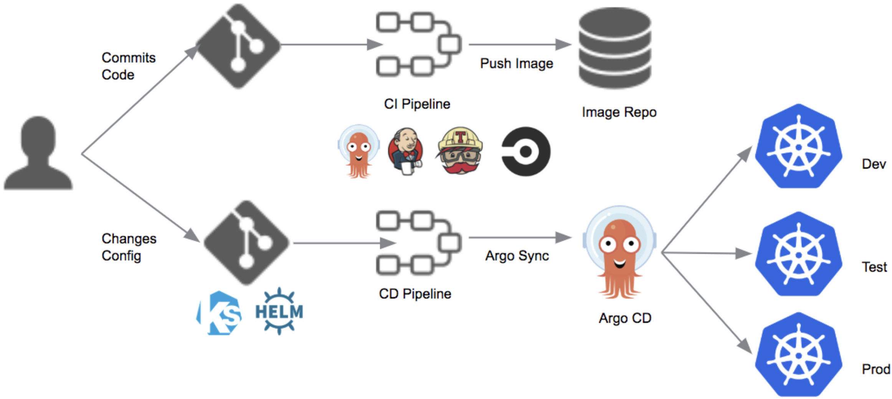
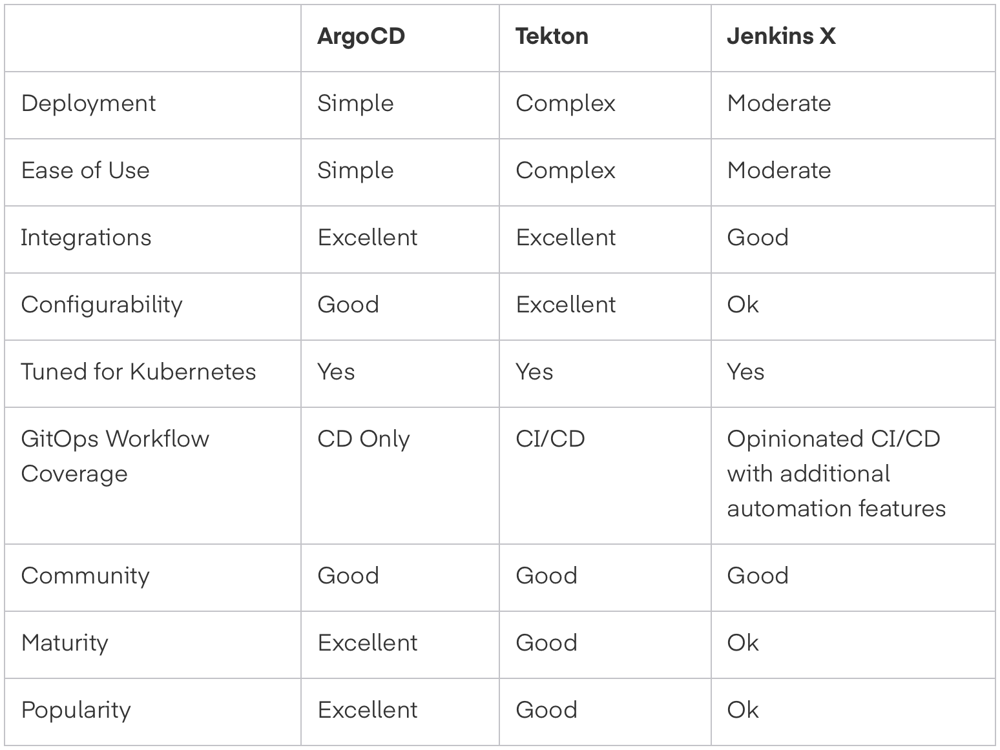
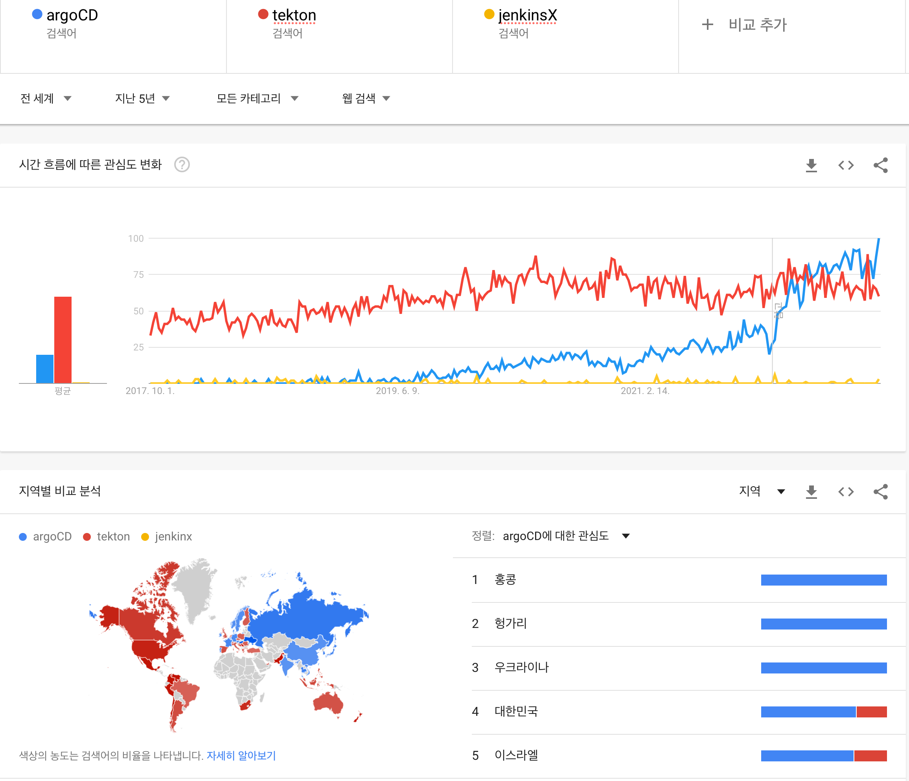

## for CI(Continuous Integration) : Jenkins

- 여전히 Jenkins가 대세임 (vs gitlab, circleCI, TeamCity, Github Action)
  - [Google Trend : Jenkins vs ...](<https://trends.google.com/trends/explore?date=today%205-y&q=jenkins,gitlab,circleCI,TeamCity,GitHub%20action>)
  - gitlab이 유의미하게 사용되는데, 미국 포함 서구권에서는 여전히 jenkins(gitlab은 중국, 러시아에서...)

## for CD(Continuous Delivery) : ArgoCD

- 윗 프로세스는 CI(Continuous Integration), 아래는 CD(Continuous Delivery)

- Kubernetes 환경에 특화한 도구로 ArgoCD, Tekton, Jenkins X등이 있음
- ArgoCD (CNCF incubating 프로젝트)를 근래에 많이 사용하는 듯
- [Argo CD vs Tekton vs Jenkins X: Finding the Right GitOps Tooling](<https://platform9.com/blog/argo-cd-vs-tekton-vs-jenkins-x-finding-the-right-gitops-tooling/>)

- [Google Trend : ArgoCD vs Tekton vs Jenkins X](https://trends.google.com/trends/explore?date=today%205-y&q=argoCD,tekton,jenkinx)

## References

- [Best 14 CI/CD Tools You Must Know | Updated for 2022](https://katalon.com/resources-center/blog/ci-cd-tools)
- [6 things I learned about CI/CD tools](https://www.czerniga.it/2022/04/25/6-things-i-learned-about-ci-cd/)
- [Top Open Source CI/CD Tools for Kubernetes to Know](https://cloud.redhat.com/blog/top-open-source-ci/cd-tools-for-kubernetes-to-know)
- [CI/CD Pipelines for Kubernetes: Best Practices and Tools](https://komodor.com/blog/ci-cd-pipelines-for-kubernetes-best-practices-and-tools/)
- [CNCF Cloud Native Interactive Landscape](https://landscape.cncf.io)
- [Introducing Argo CD — Declarative Continuous Delivery for Kubernetes](https://blog.argoproj.io/introducing-argo-cd-declarative-continuous-delivery-for-kubernetes-da2a73a780cd)
