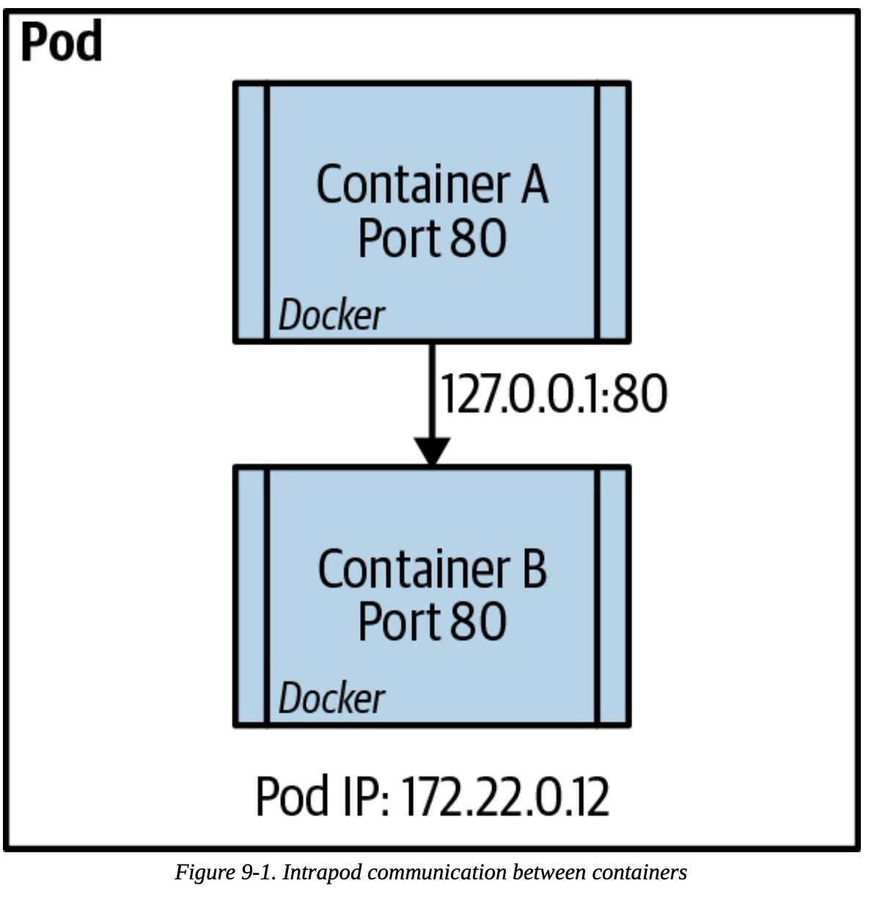
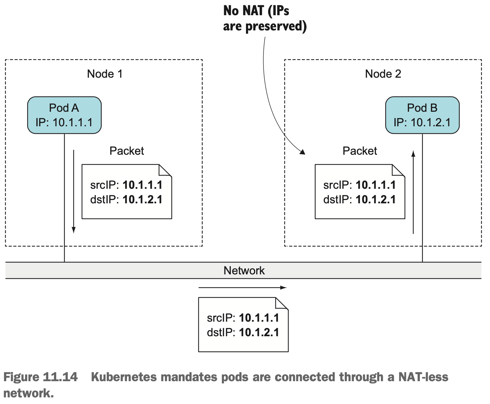
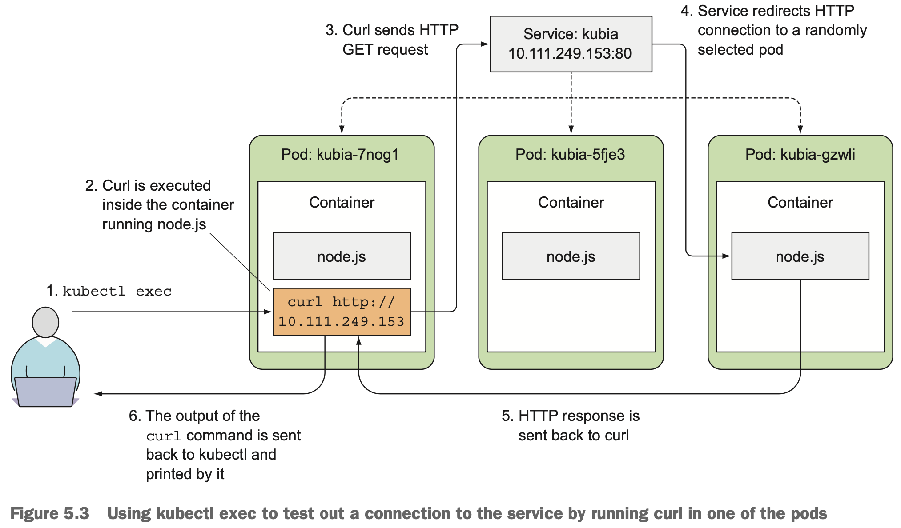
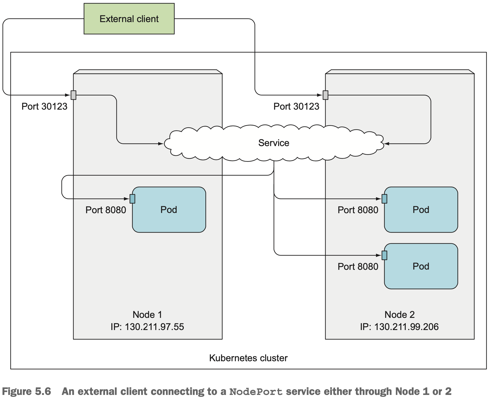
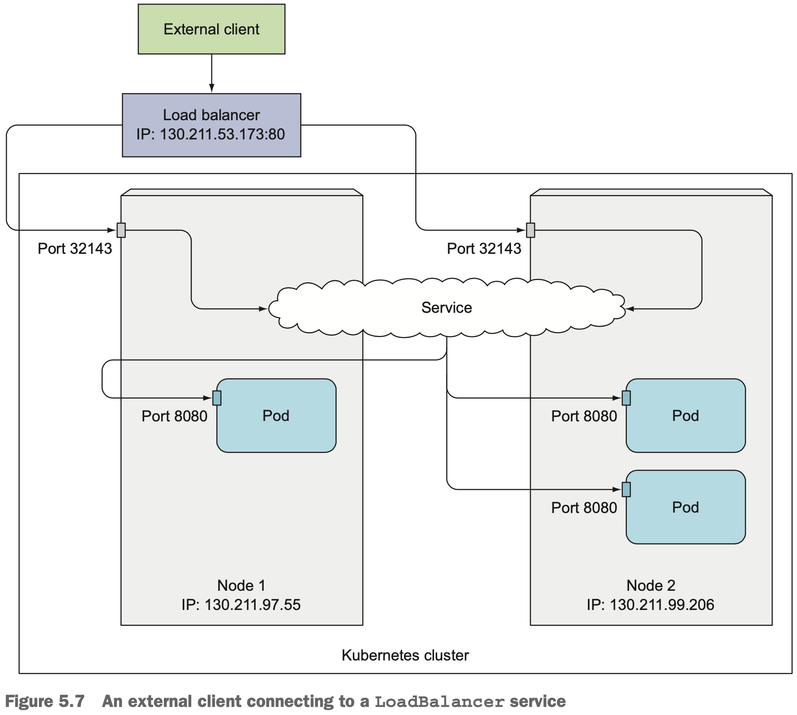
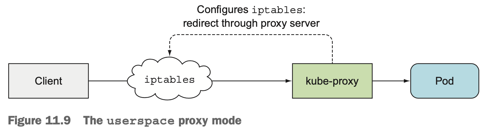
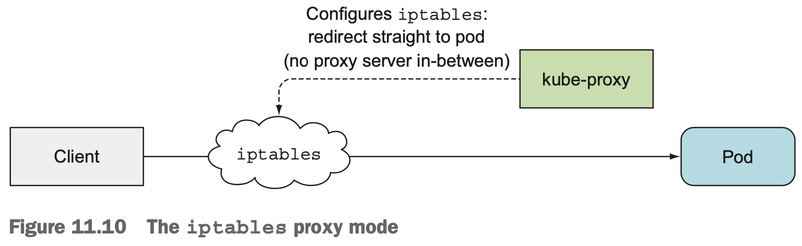
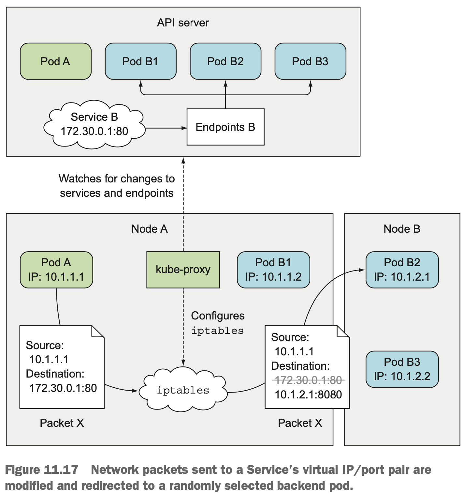

# k8s Service

- [k8s Network 기본 사항](#k8s-network-기본-사항)
- [k8s Service](#k8s-service-1)
  - [기본 사항](#기본-사항)
  - [서비스 타입 별 설명](#서비스-타입-별-설명)
  - [서비스 내부 구조 : `kube-proxy`](#서비스-내부-구조--kube-proxy)
  - [Service 생성 과정](#service-생성-과정)
- [References](#references)

## k8s Network 기본 사항

1. 동일 pod 내에서 container 간 통신은 `localhost`(`127.0.0.1`)로 가능.
  
2. 동일 cluster 내에서 pod 간 통신은 서로 다른 node에 있다 하더라도 NAT(Network Address Translation)없이 가능
   - 참고로, node 간에도 NAT 없이 통신 가능(pod <> pod, node <> node 모두 k8s mandatory)
  

## k8s Service

### 기본 사항

- 서비스(Service) 존재 이유 : 아래 문제를 해결하기 위해
  - pod는 하루살이다(ephemeral) : pod는 언제 사라질지 모름.
  - k8s는 pod에 IP 할당을 pod가 스케줄된 후에, 그리고 시작되기 전에 함 : client는 pod의 IP를 알 수 없음.
  - 수평 확장은 여러 pod가 동일 서비스를 제공 가능함을 의미함 : client는 단일 IP로 서비스에 접근할 수 없음.
- 모든 서비스(Service)는 자신만의 IP(Cluster IP, VIP(Virtual IP)), port를 가짐(예외 : headless service. `ClusterIP : None` 설정)
- **pod에 대한 자체적 load balancer 기능 포함(노드 내 pod 간, 노드 외 pod 간에 관계 없이)**
- 자체 DNS 이름을 가짐(`metadata.name` 참조).
- 3개 타입이 있음: `ClusterIP`, `NodePort`, `LoadBalancer`
- L4에서 동작함.

### 서비스 타입 별 설명

**1. `ClusterIP` 타입**
- Service 기본값.
- 이 자체 만으로는 클러스터 외부에서 해당 Service에 접근 불가

**2. `NodePort` 타입**
- 클러스터의 각 노드에 서비스 IP와 PORT에 대응하는 port를 할당
- 할당 가능 번호는 30000 ~ 32767
- `ClusterIP`의 IP, port 뿐 아니라, Node의 IP 및 해당 node port로도 접근 가능
- 일반적으로 자동 로드밸런서를 제공하지 않는 온프레미스 등에 사용

**3. `LoadBalancer` 타입**
- `NodePort`의 확장
- 외부(e.g. 클라우드 공급자)에서 제공하는 load balancer를 사용
- 보통 해당 load balancer에는 public IP를 가지며, 모든 커넥션을 service로 전달
- 서비스 별로 생성됨(One important reason is that each LoadBalancer service requires its own load bal- ancer with its own public IP address)

### 서비스 내부 구조 : `kube-proxy`

- client에서 Service로의 모든 인입은 `kube-proxy` 프로세스가 처리.
- `kube-proxy`는 Service로의 connection 발생 시 pod로 연결(설명은 `userspace` 모드로 설명했지만 기본값으로 실제는 `iptables` 모드로 동작(w/ `netfilter`. 성능상 이유). `kube-proxy`는 iptables로 rule 설정을 담당)
  
  
- `kube-proxy`는 service내 pod가 하나 이상일 경우 load balancing도 담당(When a service is backed by more than one pod, the proxy performs load balancing across those pods)
  - `userspace` 모드 : round robin
  - `iptables` 모드 : random
- Service에 할당된 IP, port는 가상이기에 이를 참조하는 모든 packet은 `kube-proxy`가 실제(pod) IP, port로 변환. 따라서 Service로는 ping도 불가.
- `kube-proxy`는 service의 변경 뿐 아니라 Endpoints 객체의 변경도 함께 모니터링함(Endpoints 객체는 해당 서비스의 모든 pod에 대한 IP/port 목록을 가짐)
  

### Service 생성 과정
  1. Service 생성 명령 전달 to API server
  2. Service는 가상 IP 할당받음
  3. API Server가 각 노드의 `kube-proxy`에 service가 생성됨을 알림
  4. 각 `kube-proxy`는 `iptables` 규칙 설정을 통해 자신의 노드에 해당 서비스의 주소에 대한 설정(destination이 서비스의 IP/port인 패킷을 가로채서, destination이 해당 서비스의 한 pod를 가리키도록 설정)

## References

- [A Guide to the Kubernetes Networking Model](https://sookocheff.com/post/kubernetes/understanding-kubernetes-networking-model/)
- [Kubernetes in Action](https://www.manning.com/books/kubernetes-in-action)
- [Kubernetes Best Practices](https://www.oreilly.com/library/view/kubernetes-best-practices/9781492056461/)
- [Configure mutual TLS authentication for applications running on Amazon EKS](<https://docs.aws.amazon.com/prescriptive-guidance/latest/patterns/configure-mutual-tls-authentication-for-applications-running-on-amazon-eks.html>)
- [Application Load Balancers Now Support Multiple TLS Certificates With Smart Selection Using SN](https://aws.amazon.com/blogs/aws/new-application-load-balancer-sni/)
- [Kubernetes Ingress with AWS ALB Ingress Controller](https://aws.amazon.com/blogs/opensource/kubernetes-ingress-aws-alb-ingress-controller/)
- [AWS Load Balancer Controller](https://github.com/kubernetes-sigs/aws-load-balancer-controller)
- [amazon-vpc-cni-k8s](https://github.com/aws/amazon-vpc-cni-k8s)
