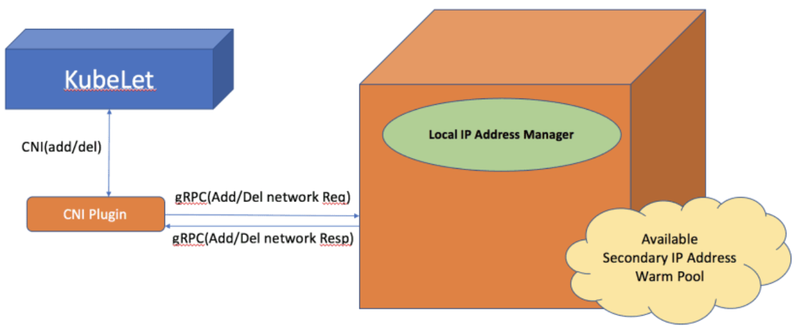
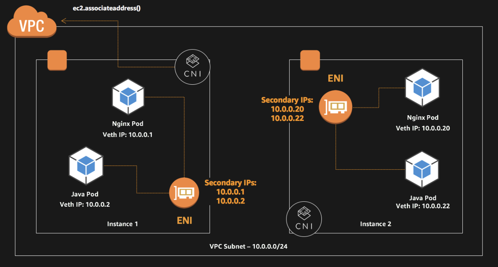

# CNI(Container Network Interface) plugin

- [기본 사항](#기본-사항)
- [AWS CNI plugin](#aws-cni-plugin)
  - [기본 사항](#기본-사항-1)
  - [pod로의 ENI 할당 절차](#pod로의-eni-할당-절차)
- [References](#references)

## CNI 기본 사항

- container가 주어진 network 환경에서 동작 가능케 함
- 노드 to 노드 communication을 가능케 함

## AWS CNI plugin

### 기본 사항

- AWS CNI plugin은 AWS에서 공식 관리하는 open source plugin
- private IPv4, IPv6 주소를 VPC에서 pod 및 Service에 할당
- **기본 VPC 네트워킹을 지원(ENI 간에는 k8s와는 관계 없이 연결 가능 - k8s와 관계 없이 VPC 기반의 AWS 인프라를 pod에도 적용 가능하다는 의미)**
- EC2 노드에는 다수의 ENI(Elastic Network Interface) 할당 가능
  - 기본적으로 1개가 자동 할당되며 이를 가리켜 primary network interface라고 함
  - 이외 추가되면 이들은 secondary network interface라고 함
  - 각 ENI에는 다수의 IP가 할당될 수 있으며 pod에 할당되는 IP는 secondary IP임(primary는 해당 pod의 외부 통신용으로 사용)
- 각 노드에는 해당 노드 만의 CIDR block이 형성됨
- ALB ingress controller에서 ip mode 지원(외부 connection을 `NodePort`를 통하지 않고 직접 pod로 연결)
- **각 노드에 허용 가능한 IP 개수**
  - min((ENI 개수 * IP 개수 - ENI 개수), 해당 subnet의 free IP)

### pod로의 ENI 할당 절차

1. plugin을 클러스터에 설치하면 `L-IPAM`(Local IP Address Manager), `CNI plugin`으로 구성된 `aws-node`란 이름의 `DaemonSet`이 각 노드에 생성됨
   - `L-IPAM`은 해당 노드에 가용 secondary IP 주소의 warm-pool 관리 
   - `L-IPAM`은 필요 시 secondary network interface를 생성 가능
2. pod 배포 명령은 해당 노드의 `kubelet` 프로세스에 전달됨
3. `kubelet` 프로세스는 `L-IPAM`에 해당 pod를 네트워크에 추가하라는 request를 전달
4. `L-IPAM`은 warm-pool에서 IP 하나를 선택해 pod에 할당

## References

- [Kubernetes용 Amazon VPC CNI 플러그인을 사용한 Amazon EKS의 Pod 네트워킹](https://docs.aws.amazon.com/ko_kr/eks/latest/userguide/pod-networking.html)
- [Proposal: CNI plugin for Kubernetes networking over AWS VPC](https://github.com/aws/amazon-vpc-cni-k8s/blob/master/docs/cni-proposal.md)
- [Increase the amount of available IP addresses for your Amazon EC2 nodes](https://docs.aws.amazon.com/eks/latest/userguide/cni-increase-ip-addresses.html)
- [amazon-vpc-cni-k8s](https://github.com/aws/amazon-vpc-cni-k8s)
- [Understand Pods communication](https://dev.to/aws-builders/understand-pods-communication-338c)
