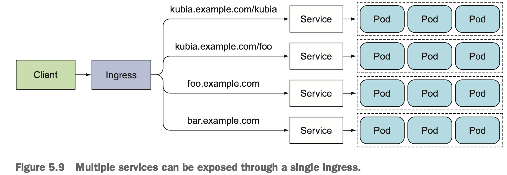
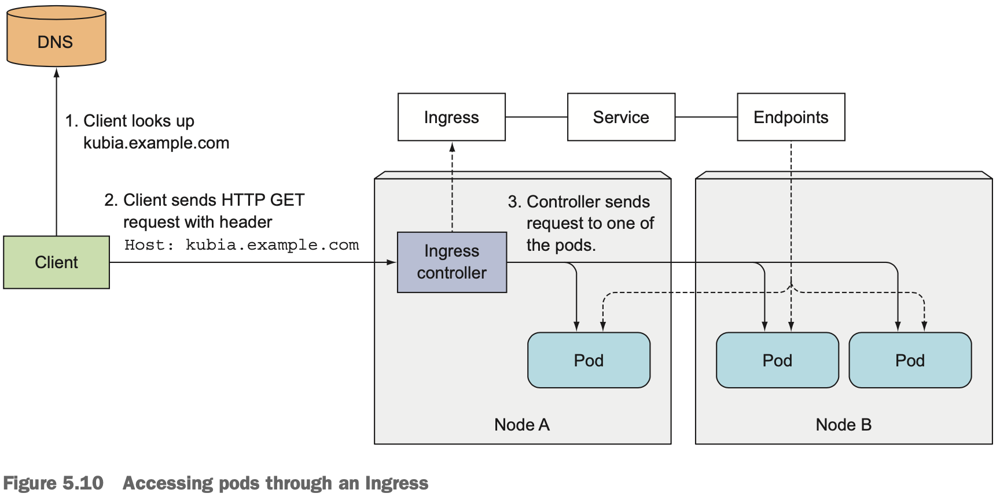
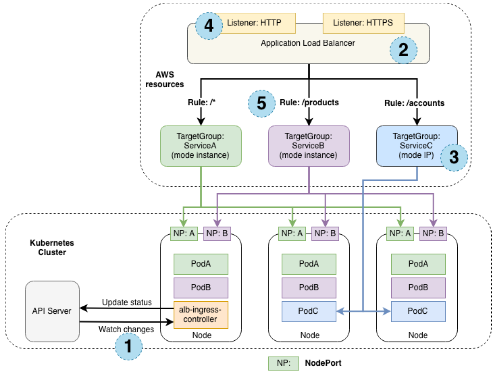

- [Ingress 기본 사항](#ingress-기본-사항)
- [Ingress 동작 절차](#ingress-동작-절차)
- [AWS ALB Ingress controller](#aws-alb-ingress-controller)
- [References](#references)

# Ingress 기본 사항

- 다음의 두 가지로 구성
  - `Ingress controller`
    - L7에서 Load Balancing을 담당하는 수행체. e.g. 보통 NGinX, HAProxy 등의 reverse proxy 제품이 Ingress controller feature를 가짐.
    - API Server와 통신하여 `Ingress Resource`에 담긴 규칙을 참조
  - `Ingress Resource` : `Ingress Controller`이 참조하는 routing 규칙. 그냥 `Ingress`라고도 불림.
- Service의 `NodePort`, `LoadBalancer` 타입과 마찬가지로 외부에서 접근 가능토록 함
- Service는 달리 L7(e.g. HTTP) 기반
- `LoadBalancer`와는 단일 `Ingress`가 달리 여러 Service에 대해 대응
  
- 일반적으로, `NodePort`를 사용하여 pod와 통신. 참고로 클라우드 공급자는 Ingress가 대응하는 Service가 `NodePort` 타입일 것을 요구(k8s의 요구사항은 아님. Ingress controllers on cloud providers (in GKE, for example) require the Ingress to point to a NodePort service. But that’s not a requirement of Kubernetes itself)

# Ingress 동작 절차

  1. client는 DNS로부터 Ingress controller의 IP를 얻음
  2. client는 Ingress controller로 HTTP request, 이때 `Host` 해더에 Domain Name을 추가.
  3. Ingress controller는 해당 해더를 갖고 어떤 Service에 접근하려는지를 확인하여 이에 연계된 Endpoints 객체를 참조하여 pod IP(들)을 얻음
  4. Ingress controller는 HTTP request를 이들 pod IP 중 하나로 forward
  5. (참고) Ingress, Service, Endpoints는 단순 참조임. 따라서 Ingress controller는 Service로 request를 보내지 않음.
  

# AWS ALB Ingress controller

- AWS ALB 역시 reverse proxy. 여기에 Ingress controller feature가 추가됨.
- 두 가지 모드로 동작
  1. instance 모드 : 일반 Ingress 처럼 `NodePort`로 forwarding
  2. ip 모드 : AWS CNI에 기반하여 pod의 IP로 직접 forwarding
- 그림 상에서 `alb-ingress-controller`의 역할이 흥미로운데, `Ingress Resource` 참조 역할을 담당(즉, 실제 packet routing은 하지 않음. 예상컨데, ALB가 범용 L7 LB 요구와 k8s의 Ingress feature 요구를 동시에 만족시키기 위해 취한 기법일 듯)

# References

- [A Guide to the Kubernetes Networking Model](https://sookocheff.com/post/kubernetes/understanding-kubernetes-networking-model/)
- [Kubernetes in Action](https://www.manning.com/books/kubernetes-in-action)
- [Kubernetes Best Practices](https://www.oreilly.com/library/view/kubernetes-best-practices/9781492056461/)
- [Configure mutual TLS authentication for applications running on Amazon EKS](<https://docs.aws.amazon.com/prescriptive-guidance/latest/patterns/configure-mutual-tls-authentication-for-applications-running-on-amazon-eks.html>)
- [Application Load Balancers Now Support Multiple TLS Certificates With Smart Selection Using SN](https://aws.amazon.com/blogs/aws/new-application-load-balancer-sni/)
- [Kubernetes Ingress with AWS ALB Ingress Controller](https://aws.amazon.com/blogs/opensource/kubernetes-ingress-aws-alb-ingress-controller/)
- [AWS Load Balancer Controller](https://github.com/kubernetes-sigs/aws-load-balancer-controller)
- [amazon-vpc-cni-k8s](https://github.com/aws/amazon-vpc-cni-k8s)
