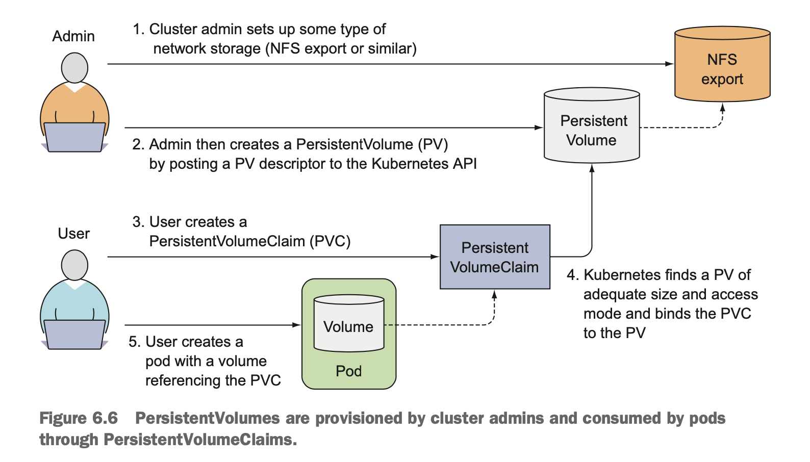
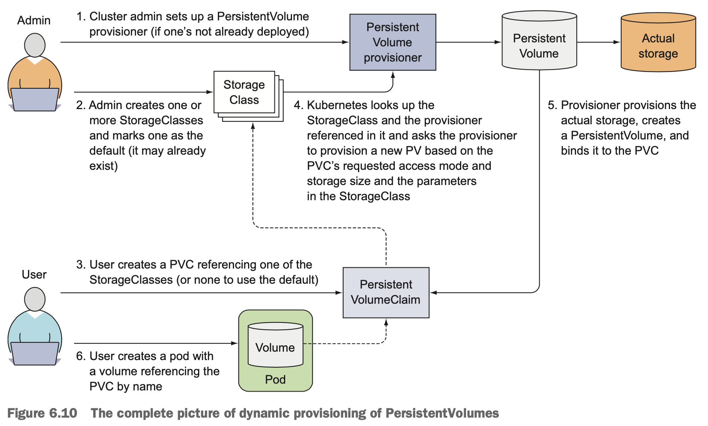
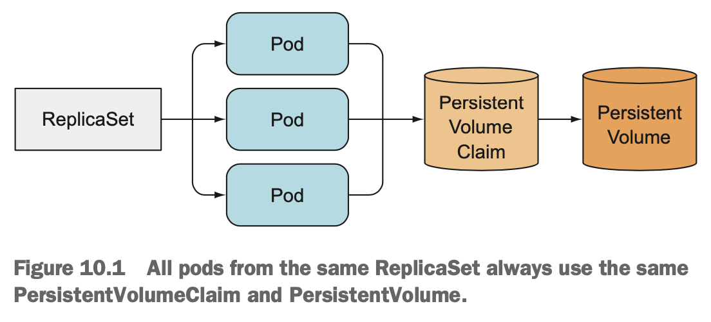
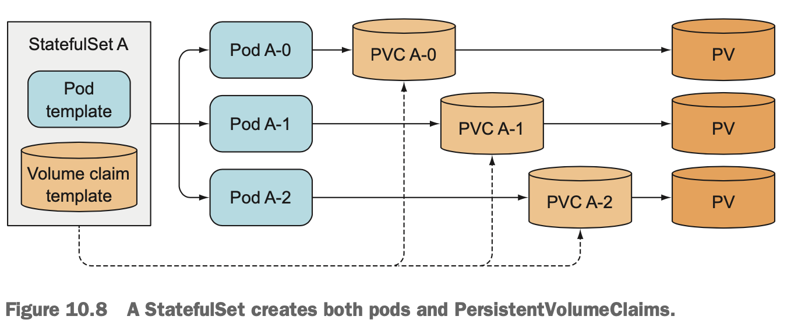

- [Volume](#volume)
  - [Host Volume](#host-volume)
  - [`PersistentVolume` (PV)](#persistentvolume-pv)
  - [`PersistentVolumeClaim` (PVC)](#persistentvolumeclaim-pvc)
  - [StorageClass](#storageclass)
- [(드디어) `StatefulSet`](#드디어-statefulset)
  - [`StatefulSet` 등장 배경](#statefulset-등장-배경)
  - [`StatefulSet` 특징](#statefulset-특징)
- [References](#references)

## Volume

<p align="center">
   
   <figcaption align="center"><b></b></figcaption>
</p>

### Host Volume

- pod가 위치한 host node내의 storage. pod 정의부의 `spec.volumes`에 정의

  ```yaml
   spec:
      containers:
         ...
         volumeMounts:
         - name: my-volume
           mountPath: /pod-volume

      volumes:
      - name: my-volume
        hostPath:
           path: /some/path/in/host/node
  ```

### `PersistentVolume` (PV)

- storage에 대한 추상화된 k8s resource. `spec.storageClassName`가 이 저장소에 대한 식별자임. 아래에서는 `hostPath`를 통해 Host Volume을 사용함을 지정했는데, NFS, AWS EBS, `configMap`, `emptyDir`, `secret` 등 다양한 형태를 정의 가능함

  ```yaml
   apiVersion: v1
   kind: PersistentVolume
   metadata:
      name: my-volume
   spec:
      storageClassName: mystorage
      capacity:
         storage: 1Gi
      accessModes:
         - ReadWriteOnce
      hostPath:
         path: /some/path
  ```

### `PersistentVolumeClaim` (PVC)

- PV를 사용하기 위한 요청(claim)을 나타내는 k8s resource. PV와는 `storageClassName`을 통해 **연결**됨 (여기서는 `mystorage`).
- PV의 관리 주체는 Storage 관리자인 반면, PVC의 관리 주체는 해당 storage의 사용자(아마도 Pod 관리자). 이로 인해 PV와 PVC 생명주기도 달라질 수 있음.
- PV와는 달리 PVC는 특정 `namespace`에 속함(왜냐하면 Pod 관리자가 관리하므로)

   ```yaml
   apiVersion: v1

   kind: PersistentVolumeClaim
   metadata:
      name: my-claim
   spec:
      storageClassName: mystorage
      accessModes:
         - ReadWriteOnce
      resources:
         requests:
            storage: 2Gi
   ```
   상기 예에서 `PersistentVolumeClaim` 사용하기 위해서는 pod manifest의 `spec.volumes`내 `hostPath` 부분을 `persistentVolumeClaim`으로 변경하면 됨.

   ```yaml
      ...
      volumes:
      - name: my-volume
         #hostPath:
         #   path: /some/path/in/host/node
         persistentVolumeClaim:
            claimName: my-claim
   ```

### StorageClass

- PV와 달리 On Demand 방식으로 volume을 생성하도록 하는 당연스럽게도 PV는 pod로부터 사용되기 전에 생성되어야 함(PV가 없을 경우 pod 생성 시 pending 상태로 됨). 이럴 때 StorageClass를 사용하는데... 무엇보다도 아래 `StatefulSet`에서 필요!

<p align="center">
   
   <figcaption align="center"><b>출처 : Kubernetes In Action</b></figcaption>
</p>

## (드디어) `StatefulSet`

### `StatefulSet` 등장 배경

- `Deployment`에 속한 모든 `ReplicaSet`의 Pod는 서로간 구분이 없는 복제본일 뿐임. 따라서 생성 순서도 없음.
- PV, PVC는 Pod간에 공유 불가. 단일 `ReplicaSet`을 통해서는 Pod별로 각기 다른 PV, PVC 지정이 불가능. 이를 해결하기 위해 `StatefulSet` 등장(?)

<p align="center">
   
   <figcaption align="center"><b>출처 : Kubernetes In Action</b></figcaption>
</p>

### `StatefulSet` 특징

- **Pod 이름에 식별자 부여** : 예컨데 mynginx란 이름의 pod를 정의하면 생성 시 mynginx-0, mynginx-1, mynginx-2...식으로 이름이 부여됨
- **Pod 생성 순서화** : 정해진 순서대로 생성
- **Pod 별로 PVC 관리** : PVC를 템플릿 형태로 정의하여 각 Pod 별로 PVC, PV 생성 관리 가능

<p align="center">
   
   <figcaption align="center"><b>출처 : Kubernetes In Action</b></figcaption>
</p>

## References

- **Kind Persistent Volumes** : <https://mauilion.dev/posts/kind-pvc/>
- **Kubenetes in Action** by MARKO LUKŠA
- **볼륨(Host Volume, PersistentVolume(PV), PersistentVolumeClaim)** : <https://jbhs7014.tistory.com/170>
- **StatefulSet** : <https://jbhs7014.tistory.com/181>
- **쿠버네티스 볼륨 개념 정리** : <https://blog.eunsukim.me/posts/kubernetes-volume-overview>
