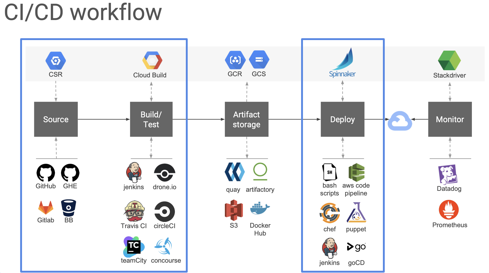

# Study# Studies

- `IP` 종류 in the point of view of `kubectl`
  - **IP**
    - TODO
  - **CLUSTER-IP**
    - TODO
  - **EXTERNAL-IP**
    - TODO
- **3rd party tools**
  - Monitoring : **Prometheus** vs Stackdriver
  - Service Mesh : Istio / kiali / Envoy / Jaeger
  - Deploy : **Ansible** vs Spinnaker
  - Helm
- python web server
  - **flask** vs django : flask가 lightweight, 빠름. 둘다 비슷하게 많이 쓰고.

